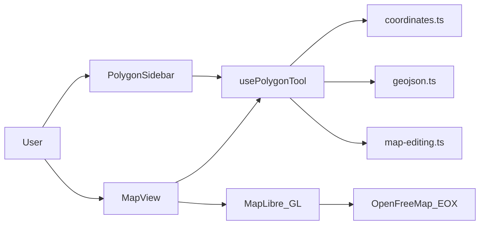

# GeoJSON Polygon Builder — Free Open-Source Map Tool

Draw, edit, import, export, and share GeoJSON polygons directly in your browser. No account required, no installation, no API keys — completely free.

**[Try the live demo](https://geojson-polygon-builder.vercel.app/)** · **[View on GitHub](https://github.com/rodrigobarona/GeoJSON-Viewer)** · Built with Next.js and MapLibre GL

---

## What is GeoJSON Polygon Builder?

GeoJSON Polygon Builder is a free, open-source web tool for creating and editing polygon boundaries on an interactive map. Click or tap to place vertices, drag handles to refine shapes, import existing coordinates or GeoJSON, and copy the result as formatted JSON or a shareable URL.

Whether you need a quick campus boundary, a delivery zone, a game map region, or a GeoJSON file for a web project, this tool gives you a simple alternative to desktop GIS software — entirely in the browser.

**Example with a pre-loaded polygon:**

[Open demo with sample polygon](https://geojson-polygon-builder.vercel.app/?coords=-72.28787496566802,42.932623683644636%7C-72.28410377979255,42.934685632022166%7C-72.28322401523552,42.932753293861396%7C-72.28303089618683,42.93056952166481%7C-72.28559508800498,42.93129221743865)

When opened without coordinates, the map defaults to Lisbon, Portugal (`-9.1393, 38.7223`).

---

## Inspired by Keene State College

This project was inspired by the [Keene State College Map Polygon/Polyline Tool](https://www.keene.edu/campus/maps/tool/) — a simple, effective browser tool for drawing polygons and exporting coordinate lists.

GeoJSON Polygon Builder builds on that idea with a modern stack and additional capabilities:

- Multiple polygons on the same map, each with its own color
- Drag-and-drop vertex editing on closed shapes
- Shareable URLs with embedded coordinates
- Full GeoJSON import and export (Polygon, LineString, FeatureCollection)
- Free basemap styles including satellite imagery
- Mobile-friendly gestures (tap to add, two-finger pan)
- Open source — fork it, self-host it, or contribute on GitHub

---

## Features

### Drawing and editing

- **Add points** — right-click on desktop, tap on mobile
- **Move vertices** — drag the white handles on the active polygon
- **Insert points on closed polygons** — right-click or tap near an edge; the new point is inserted on the nearest segment
- **Undo** — remove the last point while drawing
- **Close Shape** — finish an open polygon (requires 3+ points)
- **Reset** — clear all polygons from the map
- **Multiple polygons** — use **New** to start another shape; switch between them with numbered tabs
- **Delete** — remove the active polygon

### Import and export

- Paste coordinates one point per line as `lng, lat`
- Import GeoJSON `Polygon`, `LineString`, `Feature`, or `FeatureCollection`
- Import raw coordinate arrays (`[[lng, lat], ...]`)
- Live **Points** list and formatted **JSON** output in the sidebar
- Shapes with 3 or more points are closed automatically on import
- Polygon rings are normalized to the [GeoJSON right-hand rule (RFC 7946)](https://tools.ietf.org/html/rfc7946#section-3.1.6) using counter-clockwise winding

### Sharing

- **Share link** button copies a URL with all polygon coordinates embedded
- Anyone opening the link sees the same shapes rendered on the map
- Supports multiple polygons in a single URL

### Map

- Powered by [MapLibre GL](https://maplibre.org/)
- Four free basemap styles:
  - **Bright** (default) — OpenFreeMap
  - **Liberty** — OpenFreeMap
  - **Dark** — OpenFreeMap
  - **Satellite** — EOX Sentinel-2 cloudless imagery
- Resizable map and sidebar panels
- Map auto-fits to imported or newly added shapes

### Mobile

- Tap the map to add points
- Drag vertex handles to move them
- Use two fingers to pan the map (single-finger pan is disabled to avoid accidental panning while tapping)

---

## Who is this for?

- **GIS students and educators** learning coordinate systems and GeoJSON
- **Web developers** who need a quick polygon for a map layer, API boundary, or prototype
- **OpenStreetMap and mapping enthusiasts** defining custom areas
- **Anyone defining boundaries** — campus zones, parks, delivery areas, survey regions
- **Game map creators** building coordinate lists for tools like [Geotastic Map Maker](https://github.com/Cimera42/geotastic-map-maker)
- **Anyone searching for a free GeoJSON editor** or polygon drawer without installing QGIS or similar desktop software

---

## How to draw a polygon on the map

1. Open the **[live demo](https://geojson-polygon-builder.vercel.app/)**
2. **Right-click** the map to place points (or tap on mobile)
3. Continue adding points until your shape is complete
4. Click **Close Shape** to finish the polygon
5. **Drag** the white vertex handles to refine the boundary
6. Copy the JSON from the sidebar, or click the **Share link** button to copy a URL
7. Switch basemaps using the layer control in the top-right corner of the map

### Alternative: import coordinates

1. Click **Import** in the sidebar
2. Paste coordinates (one `lng, lat` pair per line) or GeoJSON
3. Click **Import** — the map centers on your shapes and the import panel closes automatically

### Interaction cheat sheet

| Action       | Desktop      | Mobile        |
| ------------ | ------------ | ------------- |
| Add point    | Right-click  | Tap           |
| Move vertex  | Drag handle  | Drag handle   |
| Pan map      | Click + drag | Two fingers   |
| Zoom         | Scroll wheel | Pinch         |

---

## Share polygon coordinates via URL

The app encodes polygon data in the `coords` query parameter:

```
https://geojson-polygon-builder.vercel.app/?coords=lng,lat|lng,lat|lng,lat
```

**Rules:**

- `|` (pipe) separates points within a single polygon
- `;` (semicolon) separates multiple polygons
- Coordinates use decimal degrees: longitude first, latitude second

**Single polygon example (5 points):**

```
https://geojson-polygon-builder.vercel.app/?coords=-72.28787496566802,42.932623683644636|-72.28410377979255,42.934685632022166|-72.28322401523552,42.932753293861396|-72.28303089618683,42.93056952166481|-72.28559508800498,42.93129221743865
```

**Multiple polygons example:**

```
https://geojson-polygon-builder.vercel.app/?coords=-9.14,38.72|-9.15,38.73|-9.13,38.71;-9.20,38.70|-9.21,38.71|-9.19,38.69
```

Click **Share link** in the app to generate and copy the URL automatically.

---

## Supported import formats

### Line-by-line coordinates

```
-9.139337, 38.722252
-9.142104, 38.716372
-9.135890, 38.719100
```

### GeoJSON Polygon

```json
{
  "type": "Polygon",
  "coordinates": [
    [
      [-9.139, 38.722],
      [-9.142, 38.716],
      [-9.136, 38.719],
      [-9.139, 38.722]
    ]
  ]
}
```

### GeoJSON FeatureCollection (multiple polygons)

```json
{
  "type": "FeatureCollection",
  "features": [
    {
      "type": "Feature",
      "properties": {},
      "geometry": {
        "type": "Polygon",
        "coordinates": [[[-9.14, 38.72], [-9.15, 38.73], [-9.13, 38.71], [-9.14, 38.72]]]
      }
    },
    {
      "type": "Feature",
      "properties": {},
      "geometry": {
        "type": "Polygon",
        "coordinates": [[[-9.20, 38.70], [-9.21, 38.71], [-9.19, 38.69], [-9.20, 38.70]]]
      }
    }
  ]
}
```

---

## Frequently asked questions

### Is this GeoJSON tool free?

Yes. GeoJSON Polygon Builder is completely free to use with no limits, subscriptions, or API keys required.

### Do I need to create an account?

No. The tool runs entirely in your browser. Nothing is stored on a server — your polygons exist in the page until you refresh or reset.

### What coordinate format does it use?

The tool uses **WGS 84 decimal degrees**: longitude first, latitude second (`lng, lat`). This matches the GeoJSON specification and is the same format used by most web mapping libraries.

### Can I edit existing polygons?

Yes. Import coordinates or open a share link, then drag any vertex on the active polygon to move it. Right-click or tap near an edge on a closed polygon to insert a new point.

### Does it work on mobile?

Yes. Tap to add points, drag vertices to move them, and use two fingers to pan the map.

### Can I use the output in my own project?

Yes. Copy the JSON from the sidebar and use it in any application that accepts GeoJSON — MapLibre, Leaflet, Mapbox, PostGIS, MongoDB, and others.

---

## Tech stack

| Layer      | Technology                                      |
| ---------- | ----------------------------------------------- |
| Framework  | [Next.js 16](https://nextjs.org/)               |
| UI         | [React 19](https://react.dev/), TypeScript      |
| Map        | [MapLibre GL 6](https://maplibre.org/)          |
| Geo        | [Turf.js](https://turfjs.org/) (`boolean-clockwise`) |
| Components | [shadcn/ui](https://ui.shadcn.com/) (monorepo)  |
| Styling    | Tailwind CSS 4                                  |
| Monorepo   | pnpm workspaces + Turborepo                     |
| Deploy     | [Vercel](https://vercel.com/)                   |



---

## Local development

### Requirements

- Node.js 20+
- pnpm 10+

### Setup

```bash
git clone https://github.com/rodrigobarona/GeoJSON-Viewer.git
cd GeoJSON-Viewer
pnpm install
pnpm dev
```

Open [http://localhost:3000](http://localhost:3000).

### Useful commands

```bash
pnpm dev                      # Start dev server (all apps)
pnpm --filter web dev         # Start web app only
pnpm --filter web typecheck   # TypeScript check
pnpm --filter web build       # Production build
pnpm --filter web lint        # ESLint
```

The `postinstall` and `build` scripts copy MapLibre worker files to `apps/web/public/` automatically.

See [apps/web/README.md](apps/web/README.md) for app-specific developer notes.

---

## Project structure

```
GeoJSON-Viewer/
├── apps/
│   └── web/                          # Next.js polygon tool app
│       ├── app/page.tsx              # Entry page
│       ├── components/polygon-tool/  # Map, sidebar, coordinate list
│       ├── hooks/use-polygon-tool.ts # Central state and actions
│       ├── lib/
│       │   ├── basemaps.ts           # Map style definitions
│       │   ├── coordinates.ts        # Parse, format, URL serialization
│       │   ├── geojson.ts            # GeoJSON builders and overlays
│       │   ├── map-editing.ts        # Vertex drag and edge insertion
│       │   └── shapes.ts             # Shape model
│       └── scripts/
│           └── copy-maplibre-worker.mjs
└── packages/
    └── ui/                           # Shared shadcn/ui components
```

---

## Deployment

The app is deployed on Vercel at [geojson-polygon-builder.vercel.app](https://geojson-polygon-builder.vercel.app/).

To deploy your own instance:

1. Fork this repository
2. Import it in [Vercel](https://vercel.com/new)
3. Set the **Root Directory** to `apps/web`
4. Deploy — no environment variables required

All basemaps use free, public tile endpoints. No API keys are needed.

---

## Map attribution

| Basemap   | Provider                                              |
| --------- | ----------------------------------------------------- |
| Bright    | [OpenFreeMap](https://openfreemap.org/) · OpenStreetMap |
| Liberty   | OpenFreeMap · OpenStreetMap                           |
| Dark      | OpenFreeMap · OpenStreetMap                           |
| Satellite | [EOX IT Services](https://www.eox.at/) — Sentinel-2 cloudless (CC BY-NC-SA 4.0) |

---

## Open source

This project is **open source and free to use**. Fork it, self-host it, or contribute improvements on [GitHub](https://github.com/rodrigobarona/GeoJSON-Viewer).

---

## Links

- **Live demo:** [geojson-polygon-builder.vercel.app](https://geojson-polygon-builder.vercel.app/)
- **Source code:** [github.com/rodrigobarona/GeoJSON-Viewer](https://github.com/rodrigobarona/GeoJSON-Viewer)
- **Author:** [Rodrigo Barona](https://x.com/rbarona)
- **Inspiration:** [Keene State College Map Polygon/Polyline Tool](https://www.keene.edu/campus/maps/tool/)

---

*GeoJSON editor · polygon drawer · free map tool · coordinate picker · open source GIS · browser-based polygon creator*
